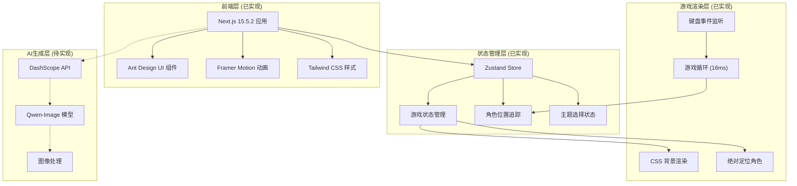
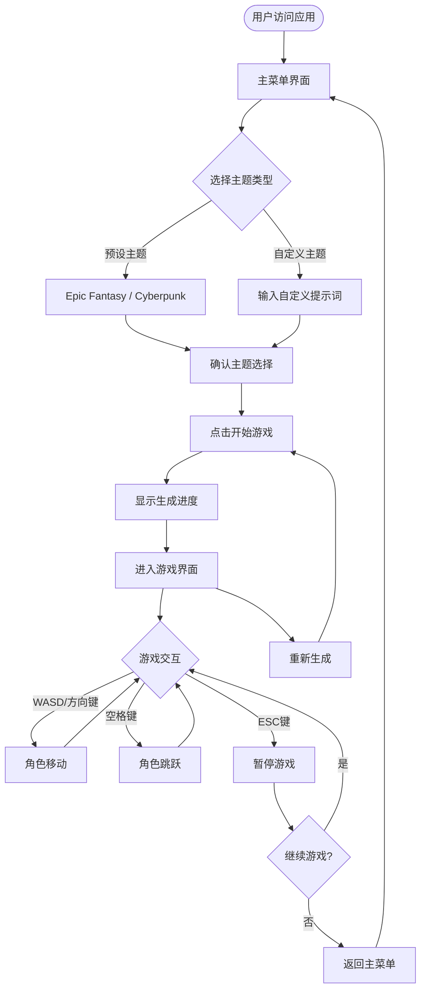
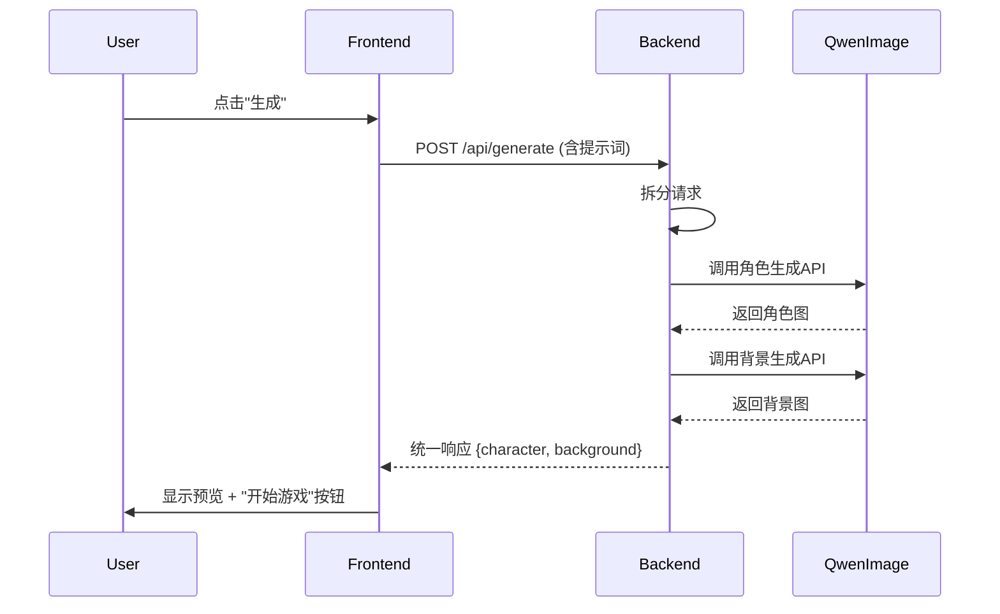

# Pixel Seed - 基于 AI 生成的 2D 像素风网页游戏

## 项目概述
“用一粒 AI 种子，生长无限像素世界”
Pixel Seed 是一款实验性 2D 像素风网页游戏，核心创新在于：游戏内容完全由用户输入的“种子”（主题/提示词）驱动。用户无需美术基础，仅需选择预设主题（如史诗魔幻、赛博朋克）或输入自定义提示词，系统即调用大模型生成专属的像素风角色形象和关卡背景，动态构建游戏世界。这验证了 AI 作为“创造源头”的潜力——将提示词转化为可玩的像素宇宙。 

### 1. 项目背景
传统像素游戏开发受限于美术资源制作周期长、风格固化。随着AI图像生成技术的发展，尤其是大模型在风格化图像生成上的突破，我们有机会构建一个“AI即内容引擎”的游戏平台。  
**Pixel Seed** 旨在通过大语言模型 + 图像生成模型，实现“输入一个种子（Seed），生成一个世界”的愿景——用户只需选择或输入一个主题，即可获得风格一致的像素游戏角色与场景，快速进入可玩的游戏体验。

### 2. 项目目标
- 实现“AI生成+即时游戏化”的闭环流程。
- 验证使用大模型生成高质量、风格统一的像素美术资源的可行性。
- 构建可扩展的架构，支持未来加入更多游戏玩法、主题风格和交互机制。

### 3. 核心理念
> **“A Seed, A World.”**  
> 每一次生成，都是一次独特的创造。AI 是世界的“种子”，玩家是世界的“探索者”。

## 功能需求

### 1. 主题选择系统

#### 1.1 预设主题 (已实现)
- **史诗魔幻 (Epic Fantasy)**：包含魔法、龙、城堡、森林等元素
- **赛博朋克 (Cyberpunk)**：包含霓虹灯、机械、未来城市等元素
- **西部世界 (Western World)**：包含牛仔、酒馆、沙漠景观、边疆小镇等元素
- **海底世界 (Underwater World)**：包含珊瑚礁、深海生物、古代海底文明等元素

```typescript
// 预设主题配置 (configs/index.ts)
export const PRESET_THEMES: Theme[] = [
  {
    id: 'epic-fantasy' as GameTheme,
    name: 'Epic Fantasy',
    description: 'A fantasy world of magic, dragons, castles, and forests',
    characterImage: 'https://img.alicdn.com/imgextra/i3/O1CN01ayAYl31bEMmWoMsJ3_!!6000000003433-2-tps-1328-1328.png',
    backgroundImage: 'https://img.alicdn.com/imgextra/i4/O1CN01DX2Y9722KlwmMkO6R_!!6000000007102-2-tps-1664-928.png'
  },
  {
    id: 'cyberpunk' as GameTheme,
    name: 'Cyberpunk',
    description: 'A sci-fi world of neon lights, machinery, and future cities',
    characterImage: 'https://img.alicdn.com/imgextra/i4/O1CN01nHC1qf203FYtqGjDS_!!6000000006793-2-tps-1328-1328.png',
    backgroundImage: 'https://img.alicdn.com/imgextra/i1/O1CN01ZV3lei1UBtKaCzJNU_!!6000000002480-2-tps-1664-928.png'
  },
  // ... 其他主题
]
```

#### 1.2 自定义主题
- 用户可手动输入提示词
- 支持中英文输入
- 提供提示词建议和示例

### 2. AI内容生成系统

#### 2.1 角色生成
- 基于选定主题生成像素风角色形象
- 支持主角、NPC、敌人等不同类型角色
- 生成多个动作帧（行走、跳跃、攻击等）

#### 2.2 关卡背景生成
- 生成符合主题的关卡背景
- 包含前景、中景、背景层次
- 支持不同关卡类型（地面、地下、空中等）

### 3. 游戏玩法系统

#### 3.1 游戏渲染方案
- **Canvas方案**：使用HTML5 Canvas绘制角色和背景
- **CSS方案**：使用div + CSS background-image展示图像
- **混合方案**：背景使用CSS，角色使用Canvas（推荐）

#### 3.2 基础交互功能 (已实现)
- **角色显示**：使用绝对定位在游戏区域显示角色
- **背景展示**：CSS背景图片作为游戏场景
- **基础动画**：
  - 角色方向翻转（左右移动时scaleX变化）
  - 平滑的位置过渡动画
  - 暂停状态的淡入淡出效果
- **角色移动**：
  - 多键位支持：WASD + 方向键
  - 跳跃动作：W键、上方向键、空格键
  - 下蹲移动：S键、下方向键
  - 实时位置更新和边界限制

#### 3.3 技术实现细节 (已实现)
- **静态场景**：当前为展示版本，无碰撞检测和敌人系统
- **键盘监听**：使用Set数据结构管理多键同时按下
- **游戏循环**：setInterval实现16ms间隔的游戏循环
- **状态管理**：Zustand管理游戏状态、角色位置、动作状态
- **重力系统**：简单的重力效果，角色自动下落到地面
- **暂停机制**：ESC键暂停/恢复游戏

#### 3.4 验证目标
- **核心目标**：验证"生成资源可立即用于游戏"的可行性
- **当前阶段**：仅验证"生成即游戏"概念
- **功能范围**：基础展示 + 简单交互，不涉及复杂游戏逻辑

### 4. 用户界面 (已实现)

#### 4.1 主菜单 (已实现)
- 项目标题和描述展示
- 主题选择功能
- 开始游戏按钮
- 响应式布局设计

#### 4.2 主题选择界面 (已实现)
- **预设主题卡片**：Epic Fantasy 和 Cyberpunk 主题
- **自定义输入框**：支持200字符限制的自定义主题输入
- **主题预览**：显示主题描述和示例元素
- **确认和重试按钮**：主题确认和重置功能
- **Radio组件**：使用Ant Design Radio实现主题选择
- **主题持久化存储**：使用localStorage保存用户创建的主题
- **主题删除功能**：支持删除自定义主题（custom-前缀主题）
- **主题创建流程**：完整的自定义主题创建和验证逻辑
- **状态管理**：集成regeneratingImages状态管理四种图像类型的生成状态

#### 4.3 主题预览界面 (已实现)
- **四象限布局**：角色、背景、地面纹理、障碍物四个预览区域
- **图像重新生成**：每个图像类型支持独立重新生成，带有重新生成按钮
- **骨架屏加载**：使用Ant Design Skeleton组件显示加载状态
- **删除按钮**：自定义主题支持删除功能，仅对custom-前缀主题显示
- **响应式设计**：适配不同屏幕尺寸
- **状态管理**：regeneratingImages状态控制各图像类型的加载状态
- **权限控制**：删除按钮仅对自定义主题可见，预设主题不可删除
- **交互反馈**：完整的错误处理和成功提示机制

#### 4.4 游戏界面 (已实现)
- **游戏画布**：使用CSS背景 + 绝对定位的混合渲染方案
- **控制提示**：底部显示WASD/方向键操作说明
- **实时信息面板**：显示角色位置、当前动作和游戏状态
- **暂停功能**：ESC键暂停游戏，显示暂停遮罩
- **返回主菜单**：游戏内返回功能
- **移动端适配**：响应式设计，支持不同屏幕尺寸

#### 4.5 加载界面 (已实现)
- **进度条显示**：使用Ant Design Progress组件
- **加载状态提示**：动态显示生成进度信息
- **骨架屏动画**：图像生成时显示骨架屏加载效果
- **状态同步**：regeneratingImages状态与UI加载状态同步

#### 4.6 游戏画布技术规格 (已实现)
- **Canvas尺寸**：全屏响应式设计，适配不同设备
- **角色位置**：初始位置(100, 400)，x轴移动范围0-800
- **背景处理**：CSS background-size: cover 自适应
- **动画帧率**：16ms间隔实现60fps游戏循环
- **重力系统**：简单的重力效果，地面高度350px

#### 4.7 状态管理架构 (已实现)

**全局状态 (lib/store.ts)**
- `gameState`: 游戏运行状态 (menu/loading/playing)
- `selectedTheme`: 当前选中的主题 (fantasy/cyberpunk/custom)
- `customPrompt`: 自定义提示词
- `characterType`: 角色类型 (player/enemy/npc)
- `levelType`: 关卡类型 (ground/underground/sky)
- `currentAction`: 当前动作状态
- `gameData`: 游戏数据对象
  - `characterUrl`: 角色图像URL
  - `levels`: 关卡数据数组
- `currentLevelIndex`: 当前关卡索引
- `totalLevels`: 总关卡数
- `levelCount`: 关卡数量配置
- `processedImages`: 已处理图像缓存
- `isLoading`: 加载状态标识
- `loadingProgress`: 加载进度 (0-100)
- `loadingMessage`: 加载提示信息
- `playerPosition`: 玩家位置坐标
- `groundTiles`: 地面瓦片数据
- `groundHeight`: 地面高度
- `obstacles`: 障碍物数组
- `isCollisionEnabled`: 碰撞检测开关

**SideMenu组件状态管理**
- `presetThemes`: 主题列表状态，包含预设和自定义主题
- `isThemeCreated`: 主题创建完成标识
- `customThemeName`: 自定义主题名称输入
- 完整的主题创建和验证逻辑
- regeneratingImages状态的设置和重置

**ThemePreview组件功能**
- 自定义主题删除权限控制（仅custom-前缀主题）
- 图像重新生成按钮和状态管理
- 骨架屏加载状态显示

**持久化存储**
- localStorage存储用户创建的主题
- 主题数据自动保存和恢复
- 支持主题删除和更新
- 自定义主题使用custom-前缀标识

**组件内部状态**
- 各组件维护自身的UI状态
- 表单输入状态
- 临时交互状态

#### 4.8 API设计 (已实现)

**主题生成API**
```typescript
POST /api/generate
{
  "theme": "Epic Fantasy Adventure",
  "prompt": "A magical realm with dragons and castles",
  "types": ["character", "background", "ground", "obstacle"],
  "levelCount": 3
}

Response:
{
  "success": true,
  "data": {
    "characterUrl": "https://...",
    "levels": [
      {
        "id": "level_1",
        "backgroundUrl": "https://...",
        "groundUrl": "https://...",
        "obstacleUrl": "https://...",
        "obstacles": [
          {
            "id": "obs_1",
            "x": 200,
            "y": 300,
            "width": 64,
            "height": 64,
            "type": "rock"
          }
        ]
      }
    ]
  },
  "generationId": "gen_123456789",
  "timestamp": "2024-01-01T00:00:00.000Z"
}
```

**图像后处理API**
```typescript
POST /api/process-image
{
  "imageUrl": "https://...",
  "type": "ground" | "obstacle"
}

Response:
{
  "success": true,
  "processedUrl": "https://...",
  "originalUrl": "https://..."
}
```

## 技术架构

### 前端技术栈
- **框架**：Next.js 15.5.2 (已实现)
- **样式**：Tailwind CSS 4.0 (已实现)
- **游戏渲染**：混合方案 - 背景使用CSS，角色使用Canvas (已实现)
- **状态管理**：Zustand 5.0.8 + localStorage持久化 (已实现)
- **UI组件**：Ant Design 5.27.1 (已实现)
- **HTTP客户端**：Fetch API (已实现)
- **动画库**：Framer Motion 12.23.12 (已实现)
- **图标库**：Ant Design Icons 6.0.0 + Lucide React 0.542.0 (已实现)
- **组件架构**：模块化组件设计，统一导出管理 (已实现)
  - 集中化UI组件导出：`components/ui/index.ts`
  - 支持类型导出和组件重导出
  - 统一的组件引用路径管理
- **配置管理**：集中化配置文件管理 (已实现)
- **数据持久化**：localStorage API用于主题存储和状态管理 (已实现)

### 后端技术栈
- **API路由**：Next.js API Routes
- **数据库**：PostgreSQL + Prisma ORM
- **文件存储**：AWS S3 或 Cloudinary
- **缓存**：Redis（可选）
- **队列处理**：Bull Queue（处理AI生成任务）

### AI集成 (已实现)
- **图像生成模型**：Qwen-Image (通过DashScope API)
- **API端点**：https://dashscope.aliyuncs.com/api/v1/services/aigc/multimodal-generation/generation
- **认证方式**：Bearer Token（API Key 仅通过环境变量或运行时输入提供，禁止写入文档与源码）
- **调用方式**：HTTP同步接口，发送POST请求后立即返回结果
- **图像规格**：角色 1328x1328px，背景 1664x928px，地面和障碍物支持多种尺寸
- **并发控制**：Promise.all 并行处理多种图像类型生成
- **延迟处理**：智能延迟机制防止API限流，支持批量生成优化
- **图像后处理**：自动抠图处理地面和障碍物图像，去除背景
- **性能监控**：内存使用监控和垃圾回收机制
- **多关卡支持**：支持生成多个关卡的图像资源
- **错误处理**：完善的异常捕获和用户友好的错误信息
- **参考文档**：GitHub - https://github.com/QwenLM/Qwen-Image

### 组件架构设计 (已实现)

#### 组件目录结构
```
components/
├── GameCanvas.tsx         # 游戏画布组件
├── SideMenu.tsx          # 侧边菜单组件 (主题选择/创建/删除)
├── ThemePreview.tsx      # 主题预览组件 (四象限布局)
├── ThemesList.tsx        # 主题列表组件
├── types.ts              # TypeScript类型定义 (含regeneratingImages)
└── ui/                   # UI组件目录
    ├── ActionButtons.tsx      # 操作按钮组件
    ├── GameInterface.tsx      # 游戏界面组件
    ├── ModelSelector.tsx      # 模型选择器组件
    ├── ProgressIndicator.tsx  # 进度指示器组件
    ├── ProjectHeader.tsx      # 项目头部组件
    ├── ThemeCustomizer.tsx    # 主题定制器组件
    ├── ThemePreview.tsx       # 主题预览组件
    ├── ThemesList.tsx         # 主题列表组件
    ├── CircularText/          # 圆形文字组件
    │   ├── index.css
    │   └── index.tsx
    ├── CurvedLoop/            # 曲线循环组件
    │   ├── index.css
    │   └── index.tsx
    ├── ScrambleText/          # 文字扰动组件
    │   ├── index.css
    │   └── index.tsx
    └── index.ts               # 统一导出文件
```

#### 核心组件功能
- **Menu.tsx**：主菜单组件，整合所有子组件，管理应用状态和regeneratingImages状态
- **GameInterface.tsx**：游戏界面组件，处理游戏渲染和交互
- **ProjectHeader.tsx**：项目头部，展示项目名称和描述
- **ModelSelector.tsx**：AI模型选择和API Key配置
- **ThemeCustomizer.tsx**：自定义主题名称和提示词输入
- **ActionButtons.tsx**：创建主题和开始游戏按钮
- **ThemesList.tsx**：预设主题列表展示和选择，支持自定义主题删除
- **ThemePreview.tsx**：主题预览区域，四象限布局显示角色和背景，支持独立重新生成
- **SideMenu.tsx**：侧边菜单，处理主题选择、创建、删除和状态回调

#### 配置管理系统
- **config.ts**：集中管理预设主题配置
  - `PresetTheme` 接口定义
  - `PRESET_THEMES` 预设主题数组
  - `CONFIG` 全局配置对象
- **types.ts**：完整的TypeScript类型定义
  - 所有组件Props接口
  - 主题和游戏数据类型
  - 事件处理函数类型
- **index.ts**：统一导出机制，简化组件导入

### DashScope API集成细节
- **请求头配置**：
  - Content-Type: application/json
  - Authorization: Bearer <YOUR_DASHSCOPE_API_KEY>
- **请求体结构**：使用messages数组格式，支持prompt_extend自动优化
- **参数配置**：
  - negative_prompt: 负面提示词（可选）
  - prompt_extend: true（启用提示词扩展优化）
  - watermark: false（关闭水印）
  - size: 支持多种尺寸（1328*1328, 1920*1080等）
- **错误处理**：实现重试机制和API限流处理

## 当前项目架构图

### 系统架构图


### 用户交互流程图


## AI生成流程设计 (已实现)

### 实现概述

项目已完整实现AI生成流程，包括：
- **API路由**：`app/api/generate/route.ts` 提供完整的生成服务
- **前端集成**：`Menu.tsx` 组件中的生成逻辑和状态管理
- **DashScope集成**：与阿里云Qwen-Image模型的完整对接
- **错误处理**：完善的异常处理和用户反馈机制
- **进度显示**：实时的生成进度和状态更新

### 生成流程时序图


### 详细实现流程

#### 1. 前端交互流程
1. **用户选择主题**：用户在主题选择界面选择预设主题或输入自定义提示词
2. **点击生成按钮**：触发生成请求，显示加载状态
3. **实时进度显示**：通过WebSocket或轮询显示生成进度
4. **预览展示**：生成完成后展示角色和背景预览
5. **确认开始**：用户确认满意后点击"开始游戏"按钮

#### 2. 后端处理流程
1. **请求接收**：接收前端POST请求，验证参数
2. **提示词构建**：根据主题和用户输入构建具体的提示词
3. **并行生成**：同时调用DashScope Qwen-Image API生成角色和背景
   - 使用 Bearer Token 认证（密钥从环境变量读取）
   - 发送HTTP POST请求到DashScope端点
   - 角色生成使用1328*1328尺寸，背景生成使用1920*1080尺寸
4. **图像处理**：对生成的图像进行格式转换和优化
5. **资源存储**：将生成的图像上传到云存储
6. **响应返回**：返回包含角色和背景URL的统一响应

#### 3. 错误处理机制
- **生成失败重试**：自动重试机制，最多3次
- **部分失败处理**：角色或背景单独失败时的降级策略
- **超时处理**：设置合理的超时时间，避免长时间等待
- **用户友好提示**：清晰的错误信息和重新生成选项

## AI生成内容规范

### 1. 图像规格
- **分辨率**：角色 1328x1328px（可后期裁剪为32x32px），背景 1664x928px
- **格式**：PNG（支持透明度）
- **色彩**：由AI模型自动生成，支持像素艺术风格调色板
- **风格**：《死亡细胞》风格像素艺术（通过prompt_extend参数优化）
- **水印**：关闭水印（watermark: false）
- **角色背景**：纯白色背景 #FFFFFF，便于后续抠图处理
- **视角约束**：严格侧身视角，保持游戏原设造型比例

### 2. 生成接口设计

#### 2.1 统一生成接口 (已实现)
```typescript
// 请求接口 (app/api/generate/route.ts)
POST /api/generate
{
  "theme": string,
  "prompt": string
}

// 响应格式
Response:
{
  "success": boolean,
  "data": {
    "characterUrl": string,
    "backgroundUrl": string
  },
  "generationId": string,
  "timestamp": string
}

// 错误响应
Error Response:
{
  "success": false,
  "error": string,
  "timestamp": string
}

// 实现示例
export async function POST(request: NextRequest) {
  try {
    const body: GenerateRequest = await request.json()
    const { theme, prompt } = body

    // 构建提示词
    const characterPrompt = buildPrompt('character', theme, prompt)
    const backgroundPrompt = buildPrompt('background', theme, prompt)

    // 并行生成
    const [characterUrl, backgroundUrl] = await Promise.all([
      callDashScopeAPI(characterPrompt, 'character', '1328*1328'),
      callDashScopeAPI(backgroundPrompt, 'background', '1664*928')
    ])

    return NextResponse.json({
      success: true,
      data: { characterUrl, backgroundUrl },
      generationId: `gen_${Date.now()}`,
      timestamp: new Date().toISOString()
    })
  } catch (error) {
    return NextResponse.json(
      {
        success: false,
        error: error instanceof Error ? error.message : 'Unknown error occurred',
        timestamp: new Date().toISOString()
      },
      { status: 500 }
    )
  }
}
```

#### 2.2 DashScope Qwen-Image调用接口 (已实现)
```typescript
// API配置
const DASHSCOPE_API_URL = 'https://dashscope.aliyuncs.com/api/v1/services/aigc/multimodal-generation/generation'
const API_KEY = process.env.DASHSCOPE_API_KEY

// 调用函数
async function callDashScopeAPI(prompt: string, type: 'character' | 'background', size: string = '1328*1328'): Promise<string> {
  const negativePrompt = GAME_TEMPLATES.negative[type]

  const response = await fetch(DASHSCOPE_API_URL, {
    method: 'POST',
    headers: {
      'Content-Type': 'application/json',
      'Authorization': `Bearer ${API_KEY}`
    },
    body: JSON.stringify({
      model: 'qwen-image',
      input: {
        messages: [
          {
            role: 'user',
            content: [
              {
                text: prompt
              }
            ]
          }
        ]
      },
      parameters: {
        negative_prompt: negativePrompt,
        prompt_extend: true,
        watermark: false,
        size: size
      }
    })
  })

  // 错误处理和响应解析
  if (!response.ok) {
    const errorText = await response.text()
    throw new Error(`DashScope API error: ${response.status} - ${errorText}`)
  }

  const result = await response.json()
  return result.output.choices[0].message.content[0].image
}

// 并行生成调用
const [characterUrl, backgroundUrl] = await Promise.all([
  callDashScopeAPI(characterPrompt, 'character', '1328*1328'),
  callDashScopeAPI(backgroundPrompt, 'background', '1664*928')
])
```

### 3. 反向提示词优化 (已实现)

为确保生成内容精准符合2D横版像素风游戏风格，系统采用了详细的反向提示词约束：

#### 角色反向约束 (GAME_TEMPLATES.negative.character)
- **3D和现实风格排除**："3D render, realistic style, photorealistic, low resolution, blurry, smooth gradients, modern UI elements, flat design, vector art, cartoon style, anime style, oversaturated colors"
- **环境元素排除**："environmental objects, scenery, landscape, background elements, terrain, ground, floor, walls, buildings, architecture, decorative objects, props, furniture, plants, trees, rocks, stones"
- **视角和构图排除**："front view, back view, three-quarter view, diagonal pose, close-up shots, partial body view, cropped limbs, cut-off head or feet, zoomed-in details, portrait mode, facing left direction"
- **背景干扰排除**："background textures, surface patterns, environmental details, contextual elements, setting indicators, ambient objects, background interference, mixed elements"

#### 背景反向约束 (GAME_TEMPLATES.negative.background)
- **角色元素排除**："characters, people, creatures, living beings, humanoid figures, animals, character silhouettes, organic life forms, human shadows, figure outlines, body shapes"
- **装备道具排除**："character equipment, weapons, armor pieces, clothing items, accessories"
- **风格约束**："3D render, realistic style, photorealistic, low resolution, blurry, smooth gradients, modern UI elements, flat design, vector art"

### 4. 生成参数配置 (已实现)

```typescript
// 游戏模板配置 (configs/index.ts)
export const GAME_TEMPLATES = {
  positive: {
    character: '2D side-scrolling pixel art character, 16-bit retro style, high contrast colors, hand-drawn texture, dynamic lighting effects, razor-sharp pixel outline, ultra-bold character silhouette, crystal-clear edge definition, complete full body sprite from head to feet, roguelike design, facing right direction, perfect right-facing side view profile pose, centered composition with proper proportions, standing upright posture, full character visible within frame, absolutely pure transparent background, completely isolated character sprite with perfect transparency, zero background interference',
    background: '2D side-scrolling pixel art background, horizontal scrolling composition, high saturation dark tones, hand-drawn texture, dynamic lighting, atmospheric depth, layered parallax elements, no characters',
    ground: '2D side-scrolling pixel art ground texture, flat rectangular tile design, simple soil or dirt pattern. CRITICAL: texture must extend completely to all four edges of the image with zero margin, filling 100% of the square area from edge to edge with complete surface coverage and no empty spaces. Texture pattern must reach every pixel boundary with uniform distribution across full tile dimensions. No borders, no gaps at edges, edge-to-edge coverage mandatory. Seamless tileable pattern, minimal texture details, basic earth tones, clean pixel art style, 16-bit retro aesthetic, solid platform surface texture, game-ready tileable asset, absolutely pure white background #FFFFFF, isolated ground tile sprite',
    obstacle: '2D side-scrolling pixel art obstacle object, 16-bit retro style, high contrast colors, hand-drawn texture, solid blocking object, game collision asset, distinct shape definition, complete obstacle sprite, centered composition, thematically consistent design elements that match the current theme style and aesthetic, contextually appropriate materials and colors that harmonize with the theme environment, obstacle design that feels naturally integrated within the theme world, absolutely pure white background #FFFFFF, completely isolated obstacle sprite'
  },
  negative: {
    character: '详细的角色反向约束...',
    background: '详细的背景反向约束...',
    ground: '详细的地面纹理反向约束...',
    obstacle: '详细的障碍物反向约束...'
  }
}

// API调用参数
const apiParams = {
  model: "qwen-image",
  prompt_extend: true,
  watermark: false,
  size: "1328*1328" // 角色，背景使用 "1664*928"
}
```

### 5. 《死亡细胞》风格提示词模板

#### 史诗魔幻主题
- **角色**："2D side-scrolling pixel art character, 16-bit retro style, dark fantasy aesthetic, medieval armor with weathered textures, magical elements with glowing effects, high contrast colors, hand-drawn texture, dynamic lighting, clear pixel outline, full body sprite, roguelike warrior design, side view profile pose, pure white background #FFFFFF, isolated character only, no environment elements, perfect for sprite extraction"
- **背景**："2D side-scrolling pixel art background, horizontal scrolling composition, dark fantasy medieval world, ancient castles with gothic architecture, mysterious forests with atmospheric lighting, high saturation dark tones, hand-drawn texture, dynamic shadows, no characters"

#### 赛博朋克主题
- **角色**："2D side-scrolling pixel art character, 16-bit retro style, dark cyberpunk aesthetic, neon-accented futuristic clothing, high-tech weaponry, high contrast neon colors, hand-drawn texture, dynamic lighting effects, clear pixel outline, full body sprite, roguelike cyber-warrior design, side view profile pose, pure white background #FFFFFF, isolated character only, no environment elements, perfect for sprite extraction"
- **背景**："2D side-scrolling pixel art background, horizontal scrolling composition, dark cyberpunk cityscape, towering skyscrapers with neon signs, industrial platforms and walkways, high saturation dark tones with neon highlights, hand-drawn texture, atmospheric lighting, no characters"

#### 西部世界主题
- **角色**："2D side-scrolling pixel art character, 16-bit retro style, dark western aesthetic, weathered cowboy attire, vintage firearms, high contrast earth tones, hand-drawn texture, dramatic lighting, clear pixel outline, full body sprite, roguelike gunslinger design, side view profile pose, pure white background #FFFFFF, isolated character only, no environment elements, perfect for sprite extraction"
- **背景**："2D side-scrolling pixel art background, horizontal scrolling composition, dark western frontier, desert landscapes with rocky formations, abandoned towns and saloons, high saturation warm tones, hand-drawn texture, sunset lighting effects, no characters"

#### 海底世界主题
- **角色**："2D side-scrolling pixel art character, 16-bit retro style, dark aquatic aesthetic, diving gear or aquatic adaptations, underwater weaponry, high contrast blue-green tones, hand-drawn texture, underwater lighting effects, clear pixel outline, full body sprite, roguelike deep-sea explorer design, side view profile pose, pure white background #FFFFFF, isolated character only, no environment elements, perfect for sprite extraction"
- **背景**："2D side-scrolling pixel art background, horizontal scrolling composition, dark underwater environment, coral reefs and ancient ruins, mysterious deep-sea caverns, high saturation blue-green tones, hand-drawn texture, volumetric underwater lighting, no characters"

### 6. 角色类型约束优化

为确保角色生成严格遵循《死亡细胞》游戏原设的侧身造型比例和特征，系统对各角色类型进行了精细化约束：

#### 玩家角色 (Player)
- **造型特征**："主角战士形象，标准人体比例，清晰的侧身轮廓，动态战斗姿态，装备细节丰富，符合roguelike主角设定"
- **比例约束**："严格侧视角度，头身比例1:6-7，武器与身体比例协调，保持游戏sprite标准"

#### 敌人角色 (Enemy)
- **造型特征**："多样化怪物设计，独特的侧身剪影，威胁性外观，符合各主题世界观的敌对生物"
- **比例约束**："侧视角轮廓清晰，大小比例适中，攻击姿态明确，便于游戏中识别和战斗"

#### NPC角色 (NPC)
- **造型特征**："非战斗角色设计，友善或中立的外观，职业特征明显，符合世界观设定"
- **比例约束**："标准侧身视角，静态或交互姿态，服装道具细节丰富，体现角色职能"

## 当前实现状态

### 已完成功能 ✅
- **基础项目架构**：Next.js + TypeScript + Tailwind CSS
- **UI组件系统**：Ant Design 完整集成
- **状态管理**：Zustand 全局状态管理
- **主题选择系统**：预设主题 + 自定义主题输入
- **游戏渲染引擎**：CSS + 绝对定位混合方案
- **角色控制系统**：多键位支持 + 重力系统
- **动画系统**：Framer Motion 平滑过渡
- **响应式设计**：移动端适配
- **游戏循环**：60fps 实时更新
- **暂停功能**：ESC键暂停/恢复
- **模块化组件架构**：完整的组件拆分和重构
- **配置文件管理**：集中化主题配置管理
- **类型系统**：完整的TypeScript类型定义
- **统一导出机制**：组件统一导出和管理

### 待实现功能 🚧
- **AI生成集成**：DashScope API 接入
- **图像处理**：生成图片的格式转换和优化
- **后端API路由**：Next.js API Routes
- **数据持久化**：游戏数据存储
- **错误处理**：生成失败重试机制

### 技术债务 ⚠️
- **模拟数据**：当前使用占位符图片，需接入真实AI生成
- **性能优化**：游戏循环可优化为requestAnimationFrame
- **测试覆盖**：缺少单元测试和集成测试

## 后续扩展计划

### 短期扩展 (1-2周)
- **AI生成集成**：完成DashScope API接入
- **真实图片渲染**：替换占位符为AI生成内容
- **错误处理优化**：完善生成失败的用户体验
- **性能优化**：游戏循环和渲染优化

### 中期扩展 (1-2月)
- **更多预设主题**：科幻、恐怖、卡通等风格
- **基础碰撞检测**：角色与环境交互
- **简单的收集元素**：道具和奖励系统
- **音效生成集成**：AI生成背景音乐和音效

### 长期扩展 (3-6月)
- **完整游戏引擎集成**：考虑Phaser.js或自研引擎
- **多关卡系统**：程序化关卡生成
- **敌人和障碍物**：AI生成的游戏机制
- **分数和成就系统**：用户进度追踪
- **多人游戏**：实时对战功能
